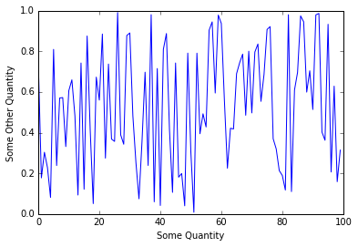

# Feature Engineering
Now that our raw data has been cleaned it's time to do some feature engineering to squeeze some extra value of out the dataset.

Below I've included a figure to show how that looks after converion to a static website.

